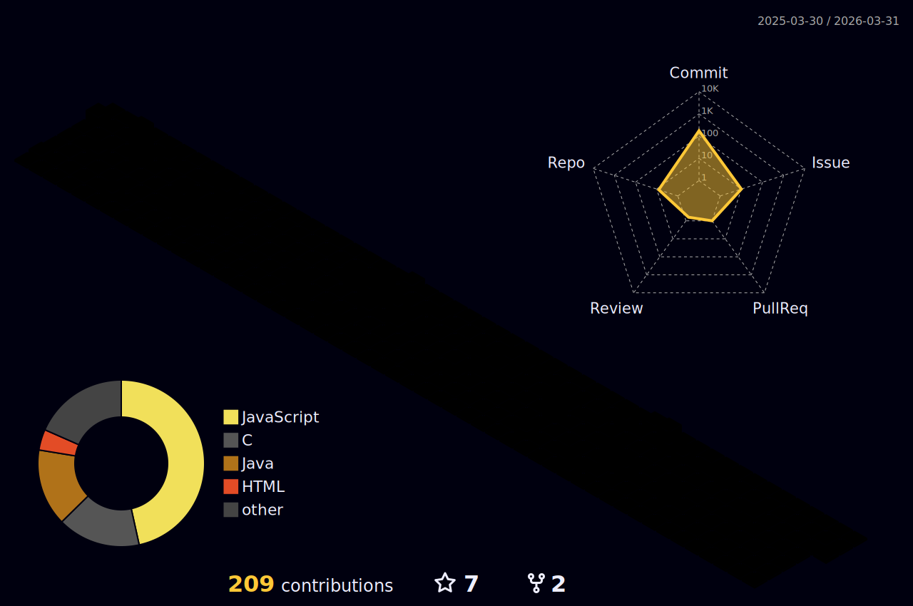

<div align="center">
  
  <!-- Header Animado -->
  

  <!-- Trophies (Tentativa com widget externo + Metrics lá embaixo) -->
  <a href="https://github.com/ryo-ma/github-profile-trophy">
    
  </a>
  <br>

  <!-- Typing SVG -->
  <p align="center">
    <a href="https://github.com/SainthixOli">
        
    </a>
  </p>

</div>

<br>

## 👨‍💻 Sobre Mim

```bash
oli@uniceplac:~$ whoami
> Oliver Arthur
> Estudante de Engenharia de Software (4º Semestre)

oli@uniceplac:~$ cat skills.txt
> Backend Development (Java, C)
> Cybersecurity & Networks
> Software Architecture
```

Sou movido pela curiosidade de entender como as coisas funcionam "por baixo do capô". Meu foco é criar arquiteturas robustas e explorar o mundo da segurança da informação.

- 🔭 **Atualmente**: Desenvolvendo plataformas Web modernas e soluções Fullstack.
- �️ **Objetivo**: Dominar a arte de proteger e escalar sistemas.
- ⚡ **Curiosidade**: Prefiro terminal do que interface gráfica (as vezes).

<br>

<!-- Skill Icons -->
<div align="center">
  <h3>🛠️ Arsenal Tecnológico</h3>
  
</div>

<br>

<!-- METRICS (Achievements + IsoCalendar) -->
<div align="center">
  <!-- Adicionando ?v=2 para forçar atualização de cache -->
  
</div>

<br>

<!-- 3D City Contribution Graph -->
<div align="center">
  <h3>🏙️ Minha Metrópole de Códigos (3D)</h3>
  
</div>

<br>

<!-- Projects Highlight -->
## 🌟 Projetos em Destaque

<table align="center" width="100%">
  <tr>
    <td width="50%" align="center">
        <h3>🚀 <a href="https://github.com/SainthixOli/cerne">Cerne</a></h3>
        <a href="https://github.com/SainthixOli/cerne">
            
        </a>
        <br><br>
        Aplicação Web focada em <strong>Inovação</strong>.
    </td>
    <td width="50%" align="center">
        <h3>📦 <a href="https://github.com/SainthixOli/modula">Modula</a></h3>
        <a href="https://github.com/SainthixOli/modula">
            
        </a>
        <br><br>
        Sistema modular e escalável.
    </td>
  </tr>
</table>

<br>

---

<div align="center">
    <a href="mailto:oliverarthursouzapinheiro@gmail.com">
        
    </a>
    <br><br>
    <!-- New Cool GIF -->
    
</div>
